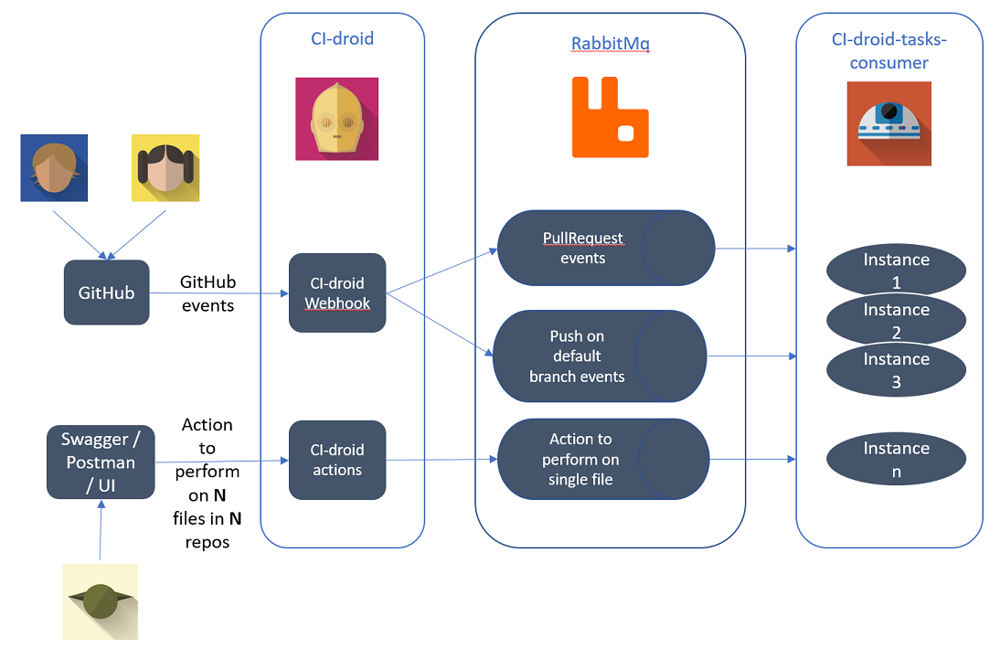

# CI-Droid

 

The dev team best buddy, taking care of all the housekeeping for your repositories and giving tips to developers !

### Overall architecture

A webhook is declared at GitHub organization level - all "push" events for all the repositories are sent to that webhook.
 CI-droid webhook is receiving these events, provided you've configured the webhook to receive the proper event types : 

If it is configured to process the events (there are some filters), it then forwards them to either 1 of 2 channels depending on where the push happened: 
- on the default branch
- on another branch than the default branch - typically for a PR

Several instances of [CI-droid tasks-consumer](https://sgithub.fr.world.socgen/devTeamTooling/CI-droid-tasks-consumer)  service are listening and processing the events on the other side of the channels. 

#### push on default branch

The main actions that we can take care when there's a push on default branch deal with the impacts on the open pull requests for the repository :
- notify developer if his/her PR is not mergeable anymore, following the push in default branch
- if the PR is still mergeable, rebase the branch with latest commits from master : the goal is to keep the PR up-to-date with default branch 
and avoid the case in which a green PR with a couple of commits from master are missing gets merged and breaks the build in default branch

#### pull request events

When a pull request event happens (either creating or updating a pull request), CI-droid can then assist the dev team by providing comments in the PR. 
We configure a map associating a file pattern to a small best practice document (ideally, the URL of a .md file), and if any of the file in the PR matches the pattern, the content of the best practice document will be "pasted" in the PR as a comment by CI-droid.

This feature makes the best practices more "alive", compared to a static document written once, refered initialy, but then rarely updated/remembered : it's very easy to add new pattern / best practice documents mapping, and to update them. 
It also enables team to save time, as the review comment is immediate and the developer can take actions before the reviewer starts reviewing.

#### adhoc actions

Especially for teams that have adopted micro-services architecture, it's not rare to have several dozens of repositories. 
They usually follow some convention(s), but when there are changes to perform across all repositories (because we upgrade to new Docker version, or we want to upgrade the version of a plugin), making the update consistently across the organization can be a daunting task, spanning over weeks. 

CI-droid has a specific endpoint that enables the user to request a bulk update. The message has these attributes : 
- user credentials : GIT username + password. Email address for outcome notifications
- update type : shall we commit directly or create a pull request ?
- the action type : do we want to replace a string in the files, overwrite the whole file, replace an XML/Yaml element in existing file ?  
- (based on action type, additional fields will be required.) 
- the commit message : when CI-droid is going to commit on user's behalf, what should be the commit message ?
- if we want to create a pull request each time, what should be the branch name to create ? 
- the list of resources to update, ie : 
    - reository full name, ie *organization/repo*
    - file path on that repo
    - branch name, where to do the change

When posting a message with a list of say 10 resources to update, message will be split in 10 messages of 1 resource each, and forwarded to the CI-droid tasks consumers. Each message will be processed independently, and the outcome (KO or OK, with details and link) will be emailed to the user. 

#### scheduled tasks - NOT IMPLEMENTED YET - required ? 

we could think of scheduled housekeeping tasks, like : 
- closing all branches for which PR has been merged
- sending a report with all the open PRs on all repos for the organization
